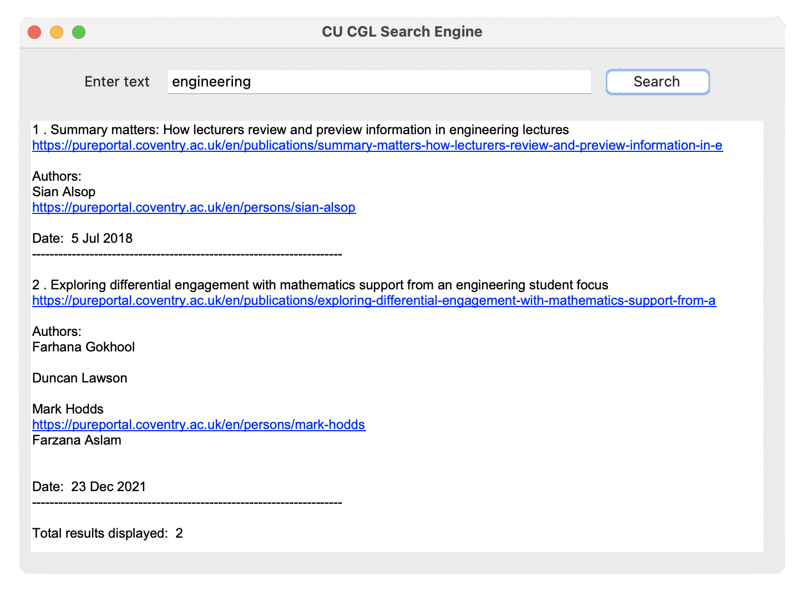

# 7071.1

# Vertical Search Engine Desktop Application For Coventry University

This repository contains Jupyter Notebooks and a database. I created a vertical search engine for Coventry University's pureportal using python.

First run the <i>scheduled_crawler.ipynb</i> file. Here, I used BeautifulSoup to crawl the webpages. The data is stored in <i>database.csv</i> file. Please note that this code runs indefinitely until it is interrupted. It is scheduled to crawl the CU webpages on every Monday at 12 o'clock midnight. Terminate the program manually when you want to stop the crawler.

Then run <i>indexing_and_query_processing.ipynb.</i> I created an inverted index for the database. Query pre-processings like tokenization, stop-words removal, stemming, etc. are done. The search engine retrieves data according to the relevance using cosine similarity.

# License
MIT License.

# Contact
If you have any questions or feedback, feel free to reach out.